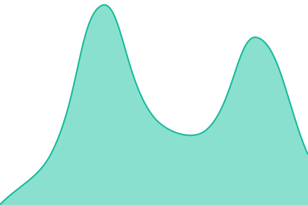
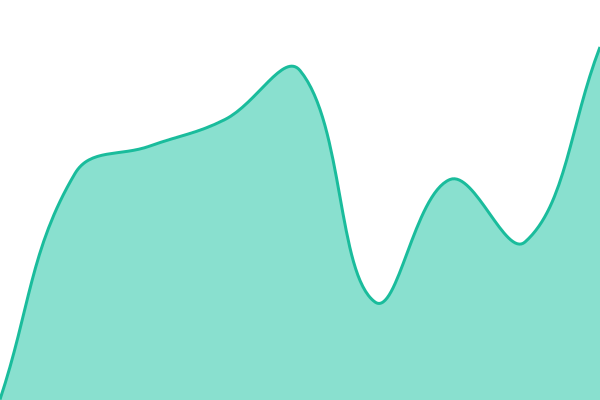
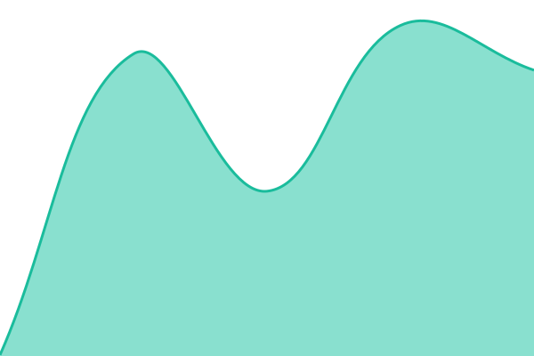

# [📈 Live Status](https://minimondocode.github.io/loftstage-status): <!--live status--> **🟩 All systems operational**

This repository contains the open-source uptime monitor and status page for [Nyx](https://minimondocode.github.io/loftstage-status), powered by [Upptime](https://github.com/upptime/upptime).

With [Upptime](https://upptime.js.org), you can get your own unlimited and free uptime monitor and status page, powered entirely by a GitHub repository. We use [Issues](https://github.com/minimondocode/loftstage-status/issues) as incident reports, [Actions](https://github.com/minimondocode/loftstage-status/actions) as uptime monitors, and [Pages](https://minimondocode.github.io/loftstage-status) for the status page.

<!--start: status pages-->
<!-- This summary is generated by Upptime (https://github.com/upptime/upptime) -->
<!-- Do not edit this manually, your changes will be overwritten -->
<!-- prettier-ignore -->
| URL | Status | History | Response Time | Uptime |
| --- | ------ | ------- | ------------- | ------ |
|  [Loftstage App & API](https://app.loftstage.com/api/health) | 🟩 Up | [loftstage-app-and-api.yml](https://github.com/minimondocode/loftstage-status/commits/HEAD/history/loftstage-app-and-api.yml) | 

 960ms
     
 | 

<a href="https://minimondocode.github.io/loftstage-status/history/loftstage-app-and-api">100.00%</a>
    

|  [Loftstage Checkout Stack (strict)](https://app.loftstage.com/api/health) | 🟩 Up | [loftstage-checkout-stack-strict.yml](https://github.com/minimondocode/loftstage-status/commits/HEAD/history/loftstage-checkout-stack-strict.yml) | 

 704ms
     
 | 

<a href="https://minimondocode.github.io/loftstage-status/history/loftstage-checkout-stack-strict">100.00%</a>
    

|  [Loftstage Marketing Site](https://loftstage.com) | 🟩 Up | [loftstage-marketing-site.yml](https://github.com/minimondocode/loftstage-status/commits/HEAD/history/loftstage-marketing-site.yml) | 

 480ms
     
 | 

<a href="https://minimondocode.github.io/loftstage-status/history/loftstage-marketing-site">100.00%</a>
    

|  [Loftstage Event Pages (edge)](https://assets.loftstage.com/fonts/) | 🟩 Up | [loftstage-event-pages-edge.yml](https://github.com/minimondocode/loftstage-status/commits/HEAD/history/loftstage-event-pages-edge.yml) | 

 482ms
     
 | 

<a href="https://minimondocode.github.io/loftstage-status/history/loftstage-event-pages-edge">100.00%</a>
    

|  [Loftstage Venue Pages](https://the-velvet-note.loftstage.com/) | 🟩 Up | [loftstage-venue-pages.yml](https://github.com/minimondocode/loftstage-status/commits/HEAD/history/loftstage-venue-pages.yml) | 

 288ms
     
 | 

<a href="https://minimondocode.github.io/loftstage-status/history/loftstage-venue-pages">100.00%</a>
    

<!--end: status pages-->

[**Visit our status website →**](https://minimondocode.github.io/loftstage-status)

## 📄 License

- Powered by: [Upptime](https://github.com/upptime/upptime)
- Code: [MIT](./LICENSE) © [Anand Chowdhary](https://anandchowdhary.com)
- Data in the `./history` directory: [Open Database License](https://opendatacommons.org/licenses/odbl/1-0/)
